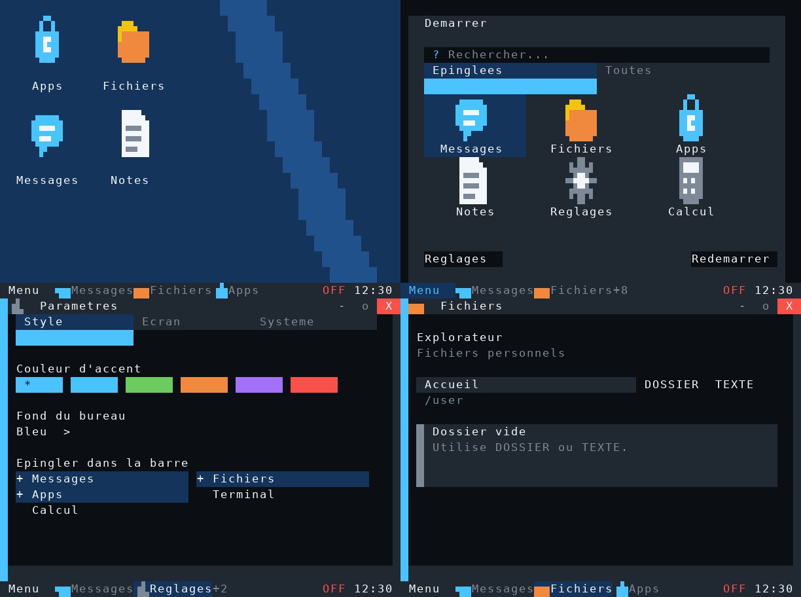

# LinkOS 0.24 — Bureau graphique

Refonte du bureau affiche directement sur le Computer. Les icones sont des
creations originales dessinees en sous-pixels ComputerCraft (8x9 pixels dans
4x3 cellules), avec une version compacte pour les menus et la barre des taches.
Le moteur utilise les caracteres graphiques natifs 128–159, sans image distante.

- Fond bleu geometrique, titres sans rectangles noirs et selection uniforme.
- Raccourcis espaces sur une grille, libelles centres et icones multicolores.
- Clic simple pour selectionner, double clic pour ouvrir ; un toucher sur monitor.
- Glisser vers une case vide ou occupee ; les positions sont sauvegardees.
- Apercu de la case pendant le deplacement ; clic dans le vide pour deselectionner.
- Sur un Computer 51x19, les fenetres peuvent aussi etre restaurees et deplacees.
- Demarrer presente six tuiles graphiques, avec recherche et liste complete.
- Parametres : Style, Ecran, Systeme ; controles essentiels visibles sur 51x19.
- Menus contextuels : rangement des icones, epinglage et personnalisation.
- Defilement tactile avec fleches haut/bas ; focus clavier visible sur le controle.
- Menu, titres des fenetres et barre des taches utilisent les nouvelles icones.
- Les corrections de visibilite de la version 0.23.1 sont conservees.

Mise a jour depuis main : `link update` sur les Computers clients.
Aucune modification du protocole ni du serveur MER.

L'apercu est reconstruit depuis les vrais caracteres et couleurs du terminal de
test ; la police du simulateur differe de Minecraft. Le moteur est teste hors jeu
sur plusieurs resolutions, ainsi que le placement et sa restauration, les clics
et le toucher monitor. Une verification dans Minecraft reste necessaire.

LevelOS reste une reference de direction visuelle demandee par l'utilisateur.
Aucun code ni asset LevelOS n'est copie. Son installateur public a pu etre lu,
mais aucun apercu officiel fiable n'a ete recupere pendant cette iteration.
